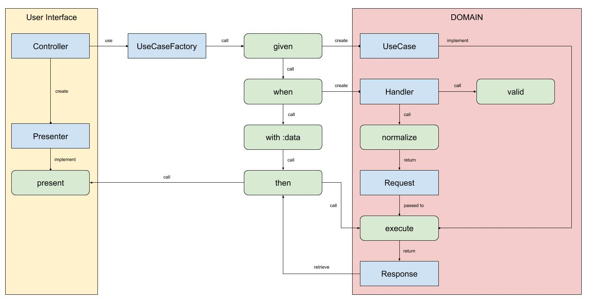

Domain Flow
===========

This PHP Library require PHP 7.4. The goal is to provide a set of tools to simplify the implementation of your use cases of your domain in Clean Architecture.

# Installation
```
composer require tboileau/domain-flow ^1.0
```

# Workflow
[](docs/workflow.jpg)

# Usage

Request :
```php
<?php

class FooRequest
{
    public string $foo;
}
```

Handler :
```php
<?php

use TBoileau\DomainFlow\Handler\HandlerInterface;

class FooHandler implements HandlerInterface
{
    public function valid(array $query): void
    {
        if (!isset($query["foo"]) || empty($query["foo"])) {
            throw new AssertionError("foo is required.");
        }   
    }

    public function normalize(?array $data = null): object
    {
        return new FooRequest(strtolower($data["foo"]));
    }
}
```

Response :
```php
<?php

class FooResponse
{
    public string $foo;
    
    public function __construct(string $foo)
    {
        $this->foo = $foo;
    }
}
```

Use Case :
```php
<?php

class Foo
{
    public function execute(FooRequest $request): FooResponse
    {
        return new FooResponse($request->foo);
    }
}
```

*Note: you can use `__invoke` instead of `execute`.*

Presenter :
```php
<?php

use TBoileau\DomainFlow\Presenter\PresenterInterface;

class FooPresenter implements PresenterInterface
{
    public string $foo;

    public function present($response = null): void
    {
        $this->foo = $response->foo;
    }
}
```

Controller:
```php
<?php

use TBoileau\DomainFlow\UseCase\UseCaseFactoryInterface;

class FooController
{
    public function __invoke(UseCaseFactoryInterface $useCaseFactory): FooResponse
    {
        $presenter = new FooPresenter();
        $useCaseFactory
            ->given(Foo::class)
            ->when(FooHandler::class)
            ->with("foo", "BAR")
            ->then($presenter)
        ;
        
        echo $presenter->foo;
    }
}
```